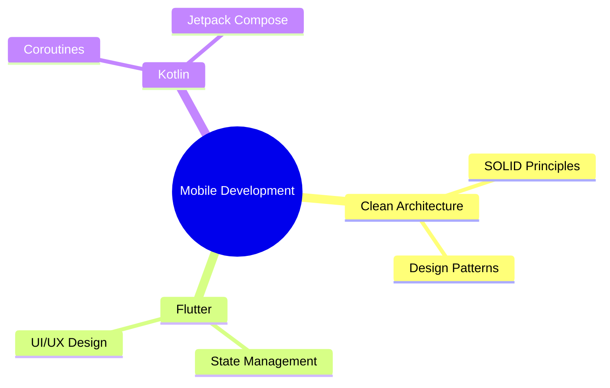

<h1 align="center">Welcome to My GitHub World! 🚀</h1>

<p align="center">
  
</p>

<div align="center">
  
</div>

## 👨‍💻 About Me

```typescript
const developer = {
    name: "Your Name",
    role: "Mobile Developer",
    education: "System Information",
    currentFocus: "Clean Architecture & Scalable Apps",
    passions: ["Mobile Development", "Innovation", "Problem Solving"]
};
```

## 🛠️ Technology Arsenal

<div align="center">

### 📱 Primary Stack
<p>
  
  
  
</p>

### 🎯 Core Skills
<p>
  
  
  
</p>

### 🔧 Tools & Platforms
<p>
  
  
  
</p>

</div>

## 📊 GitHub Analytics

<p align="center">
  
  
</p>

<p align="center">
  
</p>

## 🤝 Connect With Me

<div align="center">
  <a href="https://linkedin.com/in/yourusername">
    
  </a>
  <a href="https://instagram.com/yourusername">
    
  </a>
  <a href="https://yourportfolio.com">
    
  </a>
</div>

## 🎯 Current Focus



## ⚡ Fun Facts
- 🎮 Gaming enthusiast when not crafting code
- 📚 Avid reader of tech blogs & AI/ML developments
- 🌏 Explorer of new cultures and cuisines
- 💡 Always open to innovative collaborations

<div align="center">

### 💬 Let's Build Something Amazing Together!


</div>
